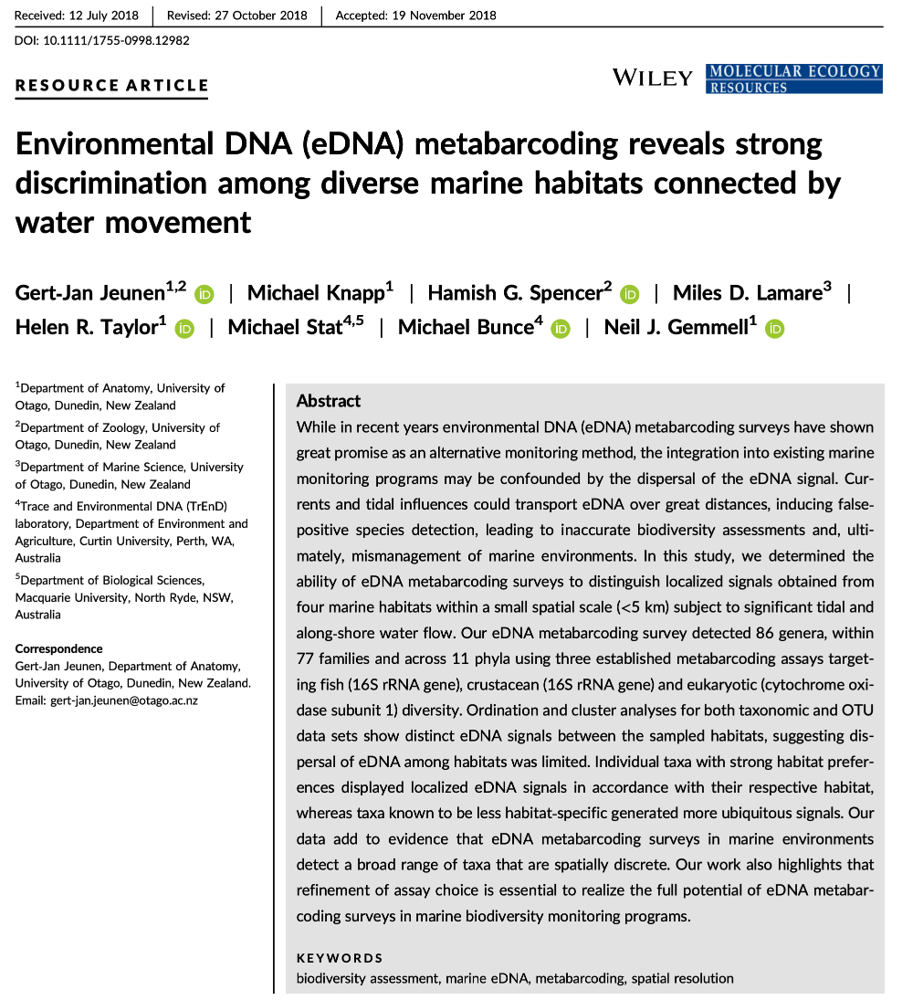
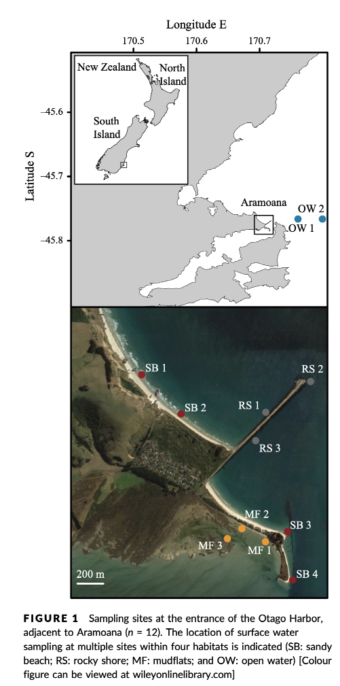

# eDNA Workshop

Welcome to the environmental DNA (eDNA) workshop session of the Otago Bioinformatic Spring School 2022!

The primary goal of this course is to introduce you to the analysis of metabarcoding sequence data, with a specific focus on environmental DNA or eDNA, and make you comfortable to explore your own next-generation sequencing data. During this course, we'll introduce the concept of metabarcoding and go through the different steps of a bioinformatic pipeline, from raw sequencing data to a frequency table with taxonomic assignments. At the end of this course, we hope you will be able to assemble paired-end sequences, demultiplex fastq sequencing files, filter sequences based on quality, cluster and denoise sequence data, build your own custom reference database, assign taxonomy to OTUs, and analyse the data in a statistically correct way.

## Introduction

Based on the 3 excellent presentations at the start of today's workshop, we can get an understanding of how broadly applicable <a href="https://en.wikipedia.org/wiki/Environmental_DNA#eDNA_metabarcoding" target="_blank" rel="noopener noreferrer"><b>eDNA metabarcoding</b></a> is and how many many research fields are using this technology to answer questions about biological systems.

Before we get started with coding, we will first introduce the data we will be analysing today, some of the software programs available (including the ones we will use today), and the general structure of a bioinformatic pipeline to process metabarcoding data. Finally, we'll go over the folder structure we suggest you use during the bioinformatic processing of metabarcoding data to help keep an overview of what is going on and ensure reproducibility of the bioinformatic pipeline.

## Experimental setup

The data we will be analysing today is taken from an experiment we published in 2018 in Molecular Ecology Resources, where we wanted to determine the spatial resolution of aquatic eDNA in the marine environment. To investigate the spatial resolution, we visited a marine environment with high dynamic water movement where we knew from traditional monitoring that there were multiple habitats present on a small spatial scale containing different community assemblages. Our hypothesis was as follows, if the spatial resolution of aquatic eDNA is high, we would encounter distinct eDNA signals at each habitat resembling the residing community. However, if aquatic eDNA is transported through water movement, from currents and tidal waves, similar eDNA signals would be obtained across this small sampling area, which would be indicative of a low spatial resolution for aquatic eDNA. Our experiment consisted of five replicate water samples (2l) at each sampling point. Water was filtered using a vacuum pump and extracted using a standard Qiagen DNeasy Blood & Tissue Kit. All samples were amplified using three metabarcoding primer sets to target fish and crustacean diversity, specifically. We also used a generic COI primer set to amplify eukaryotic eDNA signals.

For today's data analysis, we subsetted the data to only include two sampling sites and we'll only be looking at the fish sequencing data. The reason for doing so, is to ensure all bioinformatic steps will take maximum a couple of minutes, rather than hours or days to complete the full analysis.

## Software programs used for eDNA metabarcoding

Due to the popularity of metabarcoding, a myriad of software packages and pipelines are currently available. Furthermore, software packages are continuously updated with new features, as well as novel software programs being designed and published. We will be using several software programs during today's workshop, however, we would like to stress that the pipeline used in the workshop is by no means better than other pipelines and we urge you to explore alternative software programs and trial them with your own data after this workshop.

Two notes of caution about software programs:

1. While some software programs are only able to complete a specific aspect of the bioinformatic pipeline, others are able to handle all steps. It might therefore seem easier to use a program that can be used to run through the pipeline in one go. However, this could lead to a 'black box' situation and can limit you when other software programs might have additional options or better alternatives. It is, therefore, recommended to understand each step in the bioinformatic pipeline and how different software programs implement these steps. Something we hope you will take away from today's eDNA workshop.
2. One issue you will run into when implementing severl software programs in your bioinformatic pipeline is that each program might change the structure of the files in a specific manner. These modifications might lead to incompatability issues when switching fto the next program. It is, therefore, important to understand how a specific program changes the structure of the sequencing file and learn how these modification can be reverted back (through simple python or bash scripts). We will talk a little bit more about file structure and conversion throughout the workshop.

Below, we can find a list of some of the software programs that are available for analysing metabarcoding data (those marked with a '*' will be covered in this workshop):

- **Cutadapt\*** (<a href="https://cutadapt.readthedocs.io/en/stable/" target="_blank" rel="noopener noreferrer"><b>webpage</b></a>) is a program that find and removes adapter sequences, primers, and other types of unwated sequences from high-throughput sequencing reads. We will use this program to demultiplex our data.

- **USEARCH/VSEARCH\*** (<a href="https://www.drive5.com/usearch/" target="_blank" rel="noopener noreferrer"><b>webpage</b></a>), and the open-source version (which we will use)  (<a href="https://github.com/torognes/vsearch" target="_blank" rel="noopener noreferrer"><b>VSEARCH*</b></a>), has many utilities for running metabarcoding analyses. Many of the most common pipelines use at least some of the tools from these packages.

- **CRABS\*** (<a href="https://github.com/gjeunen/reference_database_creator" target="_blank" rel="noopener noreferrer"><b>webpage</b></a>) is a software package developed by our team that lets you build and curate custom reference databases.

- **Qiime2** is actually a collection of different programs and packages, all compiled into a single ecosystem so that all things can be worked together. On the <a href="https://docs.qiime2.org/2021.11/" target="_blank" rel="noopener noreferrer"><b>Qiime2 webpage</b></a> there is a wide range of tutorials and help.

- **Dada2** is a good program, run in the R language. There is good documentation and tutorials for this on its <a href="https://benjjneb.github.io/dada2/" target="_blank" rel="noopener noreferrer"><b>webpage</b></a>. You can actually run Dada2 within Qiime, but there are a few more options when running it alone in R. 

- **Mothur** has long been a mainstay of metabarcoding analyses, and is <a href="https://mothur.org/" target="_blank" rel="noopener noreferrer"><b>worth a look</b></a>

- Another major program for metabarcoding is **OBITools**, which was one of the first to specialise in non-bacterial metabarcoding datasets. The newer version, updated for Python 3, is currently in Beta. Check the <a href="https://git.metabarcoding.org/obitools/obitools3/wikis/home" target="_blank" rel="noopener noreferrer"><b>main webpage</b></a> to keep track of its development.

Additionally, there are several good R packages that can be used to analyse and graph results. Chief among these are **Phyloseq** and **DECIPHER**.

## General overview of the bioinformatic pipeline

Although software options are numerous, each pipeline follows more or less the same basic steps and accomplishes these steps using similar tools. Before we get started with coding, let's go quickly over the main steps of the pipeline to give you a clear overview of what we will cover today. For each of these steps, we will provide more information when we cover those sections during the workshop.

Prior to the general steps of the metabarcoding pipeline, you might need to conduct a few additional steps, depending on how the library was prepared for sequencing and how the library was sequenced:

- **Merging of paired-end sequencing data:** Your library can either be sequenced **single-end** or **paired-end**. If your library was sequenced **single-end**, the amplicons will be contained in a single Illumina read and the data will be provided in a single file, the R1 fastq file. If so, no additional step is needed. If your library was sequenced **paired-end**, on the other hand, you will have been given two files by the sequencing service, i.e., the R1 and R2 fastq files. If so, the amplicons are split into two parts and the R1 and R2 files will need to be merged prior to the bioinformatic pipeline. An example software package that can accomplish this is PEAR (<a href="https://cme.h-its.org/exelixis/web/software/pear/"><b>webpage</b></a>). Since the example sequencing data used during the workshop is single-end, we will not cover the merging of reads in detail.

- **Demultiplexing of sequencing data:** When you receive sequencing data from the sequencing service, the data can be split up into **a single file per sample**. If so, no additional step is needed. However, sometimes you receive **only a single fastq file**, with no information in the filename or sequence header name on which sequences belong to which sample. In this case, we will need to demultiplex the data, i.e., assigning sequences to samples by locating the forward and reverse barcode and identifying to which sample they belong. Demultiplexing the sample data is something we will cover during today's workshop in one of the first sections.

Once you have a single fastq file for each sample, the bioinformatic pipeline follows these main steps:

1. Quality filtering: remove low quality sequences.
2. Dereplication: find all unique sequences in the data.
3. Chimera removal: discard chimeric sequences that were generated during PCR amplification.
4. Clustering or Denoising: retrieve all biologically meaningful sequences in the dataset.
5. OTU table generation: create an OTU table, similar to a frequency table in traditional ecology.
6. Taxonomic assignment: create a custom reference database and assign a taxonomic ID to each biologically meaningful sequence.

After all of these steps, you are ready to move forward with the statistical analysis of your data, using either R or python.

## Using scripts to execute code

One final topic we need to cover before we get started with coding is the use of scripts to execute code. During this workshop, we will create very small and simple scripts that contain the code used to process the sequencing data. While it is possible to run the commands without using scripts, it is good practice to use this method for the following three reasons:

1. By using scripts to execute the code, there is a written record of how the data was processed. This will make it easier to remember how the data was processed in the future.
2. While the sample data provided in this tutorial is small and computing steps take up a maximum of several minutes, processing large data sets can be time consuming. It is, therefore, recommended to process a small portion of the data first to test the code, modify the filenames once everything is set up, and run it on the full data set.
3. Scripts can be reused in the future by changing file names, saving you time by not having to constantly write every line of code in the terminal. Minimising the amount needing to be written in the terminal will, also, minimise the risk of receiving error messages due to typo’s.

## The folder structure

That is it for the intro, let's get started with coding!

First, we'll have a look at the folder structure we will be using during the workshop. For any project, it is important to organise your various files into subfolders. Through the course you will be navigating between folders to run your analyses. It may seem confusing or tedious, especially as there are only a few files. Remember that for many projects you can easily generate hundreds of files, so it is best to start with good practices from the beginning.

Let's navigate to the `edna` folder in the `~/obss_2022/` directory. Running the `ls -ltr` command outputs the following subfolders:

- raw/
- input/
- output/
- meta/
- scripts/
- final/
- refdb/
- stats/

Most of these are currently empty, but by the end of the course they will be full of the results of your analysis.

So, let's begin!

