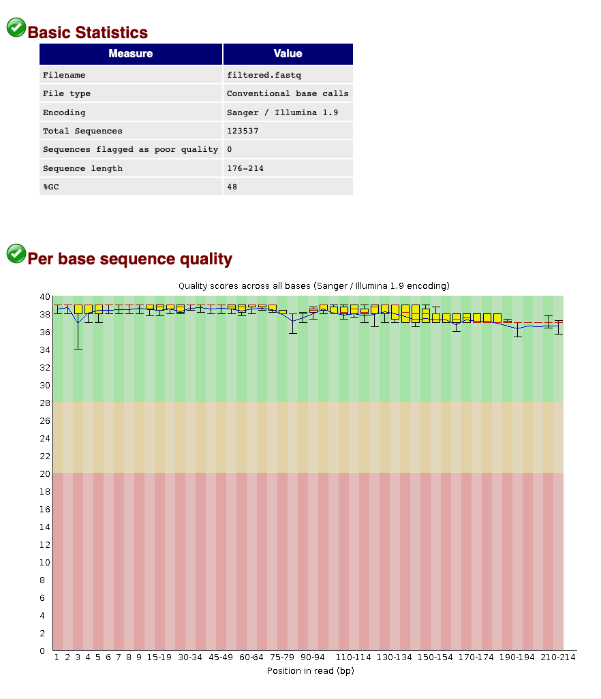

# Quality filtering

## Introduction

During the quality filtering step, we will discard all sequences that do not adhere to a specific set of rules. We will be using the program <a href="https://www.bioinformatics.babraham.ac.uk/projects/fastqc/" target="_blank" rel="noopener noreferrer"><b>VSEARCH (EMP)</b></a> for this step. During quality filtering, we will filter out all sequences that do not adhere to a minimum and maximum length, have unassigned base calls (‘N’), and have a higher expected error than 1. Once we have filtered our data, we can check the quality with FastQC and compare it to the raw sequencing file.

## Filtering sequence data

```bash
$ nano qual
```

```bash
$ #!/bin/bash
$
$ source moduleload
$
$ cd ../output/
$
$ vsearch --fastq_filter relabel.fastq --fastq_maxee 1.0 --fastq_maxlen 230 --fastq_minlen 150 --fastq_maxns 0 --fastaout filtered.fasta --fastqout filtered.fastq
```

```bash
$ chmod +x qual
```

```bash
$ ./qual
```

```
vsearch v2.17.1_linux_x86_64, 503.8GB RAM, 72 cores
https://github.com/torognes/vsearch

Reading input file 100%  
123537 sequences kept (of which 0 truncated), 5337 sequences discarded.
```
{: .output}

After quality filtering, we have 123,537 sequences left over in the fastq and fasta files. Before we continue with the pipeline, let's check if the quality filtering was successful using **FastQC**.

```bash
nano qualcheck
```

```bash
#!/bin/bash

source moduleload

cd ../output/

fastqc filtered.fastq -o ../meta/
```

```bash
$ chmod +x qualcheck
```

```bash
$ ./qualcheck
```

<center></center>

When we now look at the *Basic Statistics* and *Per base sequence quality* tabs, we can see that:

1. Our total number of sequences has been reduced to 123,537, similar to the number specified by our `qual ` script.
2. The sequence length ranges from 176-214, according to amplicon length and within the range of the parameters chosen in the `qual` script.
3. The sequence quality is high throughout the amplicon length (within the green zone).

We can, therefore, conclude that quality filtering was successful and we can now move to the clustering step of the pipeline.

> ## Count the number of sequences in a fastq file
> before we continue with our bioinformatic pipeline, let's first determine how to count the number of sequences in a fastq file in the terminal
>
> Hint 1: think about the file structure of the fastq file.
> Hint 2: think about how to calculate number of sequences in a fasta file
> 
>> ## Solution
>> ~~~
>> grep -c "^@" filtered.fastq
>> ~~~
> {: .solution}
{: .challenge}


